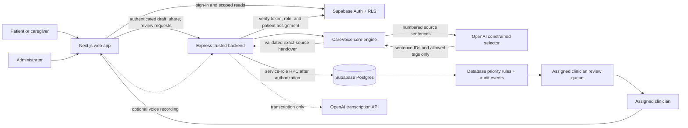
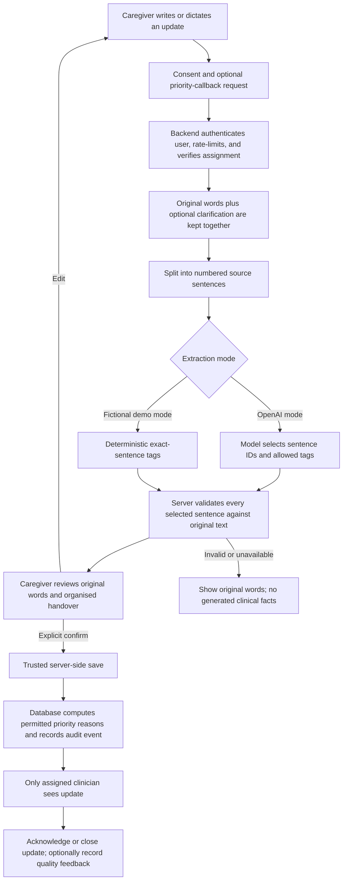

# CareVoice Relay

## Overview

CareVoice Relay is a deployed web application for structured, reviewable palliative-care handovers. Patients and caregivers share updates in their own words; assigned clinicians see a consistent, evidence-backed handover alongside the complete original message.

It is **not** a diagnostic, treatment, medication, triage, or emergency service. The clinician remains the decision-maker.

## Problem Statement

Caregivers often describe changes in a person's condition using long, ordinary language: fatigue, disrupted sleep, difficulty moving, appetite changes, or a request for help. A clinician needs to understand those updates quickly, but a generic AI summary can lose a negation, invent a detail, or make an unsupported medical inference.

The problem is not a lack of generated clinical prose. It is the risk of losing the caregiver's original meaning during handover.

## Solution

CareVoice Relay turns a caregiver's free-text update into a reviewable handover without letting AI write new clinical facts.

The OpenAI-backed selector receives numbered source sentences and can return only source-sentence IDs and predefined tags. The server validates every selected sentence against the original message, constructs the visible handover locally, and falls back to the original words if output cannot be verified. The caregiver reviews and explicitly confirms the update before a trusted backend persists it. Only assigned clinicians can review, acknowledge, close, or provide quality feedback on an update.

## Features

- Typed care updates and optional, editable voice transcription.
- Explicit consent before sharing and one optional non-clinical clarification at a time.
- Evidence-backed handovers created only from complete sentences in the submitted update; no model-written clinical prose is shown.
- A safe fallback: `Structured handover unavailable — review the original message.` No generated facts are saved when extraction cannot be verified.
- Deterministic priority-review reasons: a caregiver's explicit callback request or the clinician-owned “normal daily care cannot continue” rule. Urgent-sounding language alone never becomes a medical urgency decision.
- Role-specific patient, caregiver, clinician, and administrator workflows with explicit patient assignments.
- Caregiver review-before-share and clinician lifecycle controls: `new → acknowledged → closed`.
- Database-owned timestamps, immutable review events, and clinician handover-quality feedback kept separate from the original care update.
- Fictional offline demo mode using deterministic exact-source tags, plus a separate OpenAI-backed extraction mode.

The interface keeps persistent **Not an emergency service** and **Care coordination only** notices. Voice input requires acknowledgement before recording, and the resulting text remains editable before sharing.

## Tech Stack

- **Frontend:** Next.js, React, TypeScript, CSS.
- **Backend:** Node.js, Express, TypeScript, a dedicated CareVoice core engine.
- **Database:** Supabase PostgreSQL, Row Level Security, SQL migrations, server-owned RPCs.
- **APIs / Services:** Supabase Auth, OpenAI Agents SDK for constrained source selection, OpenAI transcription API for optional voice input.
- **Hosting / Deployment:** Frontend deployed on [Vercel](https://carevoice-frontend.vercel.app/); local development workflow is also supplied.
- **Other Tools:** Zod schema validation, Node test runner, TypeScript, ESLint, Mermaid architecture diagrams, npm workspaces.

## Codex / OpenAI Usage

Codex was used as a development collaborator for ideation, threat-modeling, architecture planning, implementation, debugging, test design, documentation, and the reviewer-facing repository structure.

The organiser-provided OpenAI and Supabase services power the application. OpenAI services are used in two constrained ways:

- The OpenAI Agents SDK selects only numbered source-sentence IDs and allowed tags for a handover. It is not allowed to diagnose, decide urgency, prescribe, or author clinician-facing prose.
- The optional voice-input path uses OpenAI transcription to convert a recording into editable text before the caregiver reviews it.
- Supabase provides authentication, PostgreSQL storage, Row Level Security, scoped patient assignments, and the trusted server-side RPCs used for protected care-update actions.

The project also includes a clearly labelled deterministic fictional demo mode. This allows an evaluator to inspect the complete workflow without an API key; it is not represented as live AI processing.

## Demo

### Live Demo

The live application is available at **[carevoice-frontend.vercel.app](https://carevoice-frontend.vercel.app/)**. A reproducible fictional demo can also be run locally using the steps below.

### Demo / Pitch Video

The live deployment above is the primary product demonstration. It supports the caregiver-to-clinician workflow described in this repository.

## Screenshots

The live application can be viewed at [carevoice-frontend.vercel.app](https://carevoice-frontend.vercel.app/). Any future repository screenshots should use fictional data and show:

1. The caregiver's long, plain-language update.
2. The review screen, including original words and the exact-source handover.
3. The clinician queue, lifecycle controls, and handover-quality feedback.

The architecture and data-processing diagrams below are included now so repository reviewers can understand the workflow without running the application.

## Architecture and Data Processing

```text
frontend/       Next.js role-specific interfaces
backend/        Express authentication, draft, trusted-save, and status APIs
database/       Supabase migrations, RLS, RPCs, assignments, and audit schema
core-engine/    Evidence-backed extraction contract and deterministic priority rules
tests/          Unit, static-security, and fictional evaluation coverage
```

### System architecture



### Care-update data flow



**Safety boundary:** the model is never allowed to diagnose, prescribe, determine medical urgency, author a clinical summary, or persist data directly. It may only select submitted sentence IDs and predefined tags; the server validates and stores the final handover.

## How to Run Locally

```bash
git clone https://github.com/sonalreji7/CareVoice.git
cd CareVoice
cp .env.example .env.local
npm install
```

Configure the Supabase URL, publishable key, and server-only service-role key in `.env.local`, then apply every migration in `database/supabase/migrations/` to a dedicated Supabase project. Use `supabase db push` after linking the project, or apply the migration files in order through the Supabase SQL editor.

Then start the fictional demo:

```bash
npm run seed:demo -- --reset-password
npm run dev
```

For the reproducible fictional demo, set `CAREVOICE_DEMO_MODE=1` and restart the backend. The seed command creates a fictional patient, caregiver, clinician, and administrator, then prints a temporary password once. Keep it private; do not commit it or use it with real health information.

For the OpenAI-backed path, set `CAREVOICE_DEMO_MODE=0`, provide `OPENAI_API_KEY`, and restart the backend. The same fictional update will then be processed by the constrained source selector.

## Additional Notes

### Roles

- **Patient:** Views and submits only personal updates.
- **Caregiver:** Views and submits only for explicitly linked patients; can request a priority callback.
- **Clinician:** Reads only explicitly assigned patients’ updates; acknowledges and closes them through the trusted backend flow.
- **Administrator:** Manages non-admin roles and caregiver/clinician assignments; cannot read care updates merely by being an administrator.

### Fictional workflow walkthrough

1. Sign in as the seeded fictional caregiver and select **Load detailed fictional update**.
2. Select consent and **Request a priority callback**, then choose **Prepare review**.
3. Review the original words and the structured, source-backed handover. Answer or skip the one optional clarification.
4. Choose **Confirm and share**. Draft preparation alone does not save an update.
5. Sign in as the fictional assigned clinician, open the update, review the original words, acknowledge it, close it, and optionally record handover-quality feedback.

### Evaluator evidence

This repository is designed to be judged from evidence rather than promises.

| Claim | Evidence in this repository |
| --- | --- |
| The model cannot author a clinical handover | [`core-engine/src/extraction.ts`](core-engine/src/extraction.ts) gives the model only source-sentence IDs and tags, then materialises display text on the server. |
| Invented facts and lost negations are rejected | [`tests/extraction.test.ts`](tests/extraction.test.ts) covers invented facts, altered evidence, negations, prompt-like text, and mixed-language updates. |
| A user must review before an update is persisted | [`tests/workflow-contract.test.ts`](tests/workflow-contract.test.ts) verifies the explicit confirmation step. |
| Browser clients cannot directly write care updates | [`database/supabase/migrations/202609200009_server_owned_care_updates.sql`](database/supabase/migrations/202609200009_server_owned_care_updates.sql) revokes browser writes and exposes service-role-only RPCs. |
| Access and feedback are assignment-scoped | [`tests/security-migration.test.ts`](tests/security-migration.test.ts) verifies clinician assignment, server-only feedback, and restricted database permissions. |

For a detailed reproducible walkthrough, see [`docs/JUDGE-GUIDE.md`](docs/JUDGE-GUIDE.md). For the deliberate product and safety trade-offs, see [`docs/DECISIONS.md`](docs/DECISIONS.md).

### Checks

```bash
npm test
npm run typecheck
npm run lint
npm run build
```

The tests use fictional text only. Two opt-in tests—a live OpenAI selector evaluation and a dedicated Supabase RLS integration test—are skipped by default because they require separately configured test services. They are not presented as completed clinical validation.

Before broader clinical deployment, CareVoice needs clinical governance, privacy and legal review, production-scale rate limiting, security review, observability policy, incident procedures, backups, durable drafts, clinician notification policy, and live Supabase RLS acceptance tests. It does not claim clinical validation or medical-device certification.
