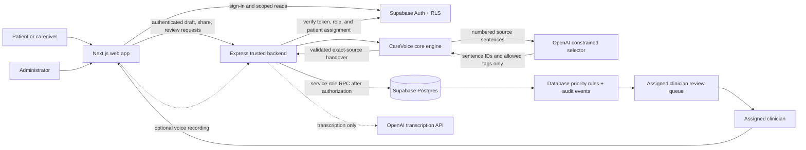
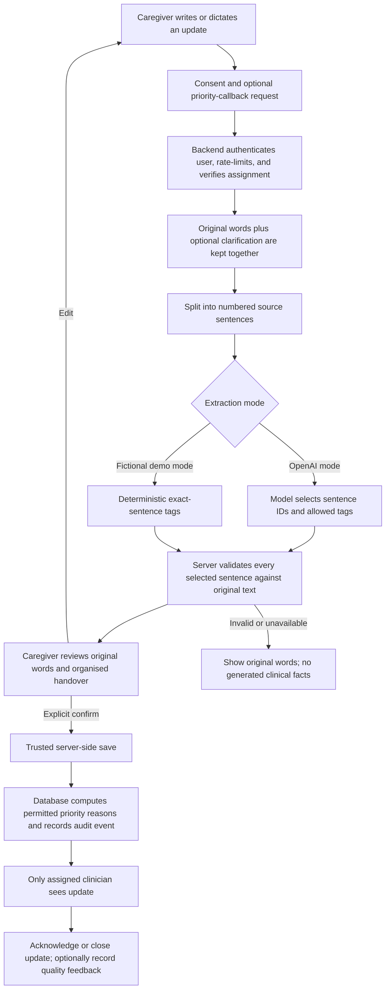

# CareVoice Relay

CareVoice Relay is a hackathon prototype for structured, reviewable palliative-care handovers. Patients and caregivers share their own words; clinicians see a consistent evidence-backed handover alongside the original message. It is not a diagnostic, treatment, medication, triage, or emergency service.

## What it does

- Gives patients and caregivers a private update workflow with typed input and optional, editable voice recording/transcription.
- Shares after the explicit consent checkbox. A user can optionally answer one non-clinical clarification at a time, or skip it.
- Creates a handover only from complete sentences in the submitted words. Every displayed field is duplicated in source evidence; no model-written clinical prose is shown.
- Shows `Structured handover unavailable — review the original message.` when extraction cannot be verified. This safe demo-mode fallback does not invent facts.
- Uses deterministic priority rules only: an explicit caregiver callback request or the clinician-owned “normal daily care cannot continue” rule. Urgent-sounding text alone does not create priority.
- Scopes caregivers and clinicians to explicit patient assignments, and gives administrators access-management controls without access to care updates.
- Records trusted review transitions (`new → acknowledged → closed`) with database-owned timestamps and immutable audit events.

The interface keeps persistent **Not an emergency service** and **Prototype only** notices. Voice recognition requires an acknowledgement before it starts and states that speech processing is provided by the browser or its speech provider; CareVoice does not store audio.

## Evaluator guide

This repository is designed to be judged from evidence rather than promises. Start with the architecture below, then use these paths to verify the core claims.

| Claim | Evidence in this repository |
| --- | --- |
| The model cannot author a clinical handover | [`core-engine/src/extraction.ts`](core-engine/src/extraction.ts) gives the model only source-sentence IDs and tags, then materialises display text on the server. |
| Invented facts and lost negations are rejected | [`tests/extraction.test.ts`](tests/extraction.test.ts) covers invented facts, altered evidence, negations, prompt-like text, and mixed-language updates. |
| A user must review before an update is persisted | [`tests/workflow-contract.test.ts`](tests/workflow-contract.test.ts) verifies the explicit confirmation step. |
| Browser clients cannot directly write care updates | [`database/supabase/migrations/202609200009_server_owned_care_updates.sql`](database/supabase/migrations/202609200009_server_owned_care_updates.sql) revokes browser writes and exposes service-role-only RPCs. |
| Access and feedback are assignment-scoped | [`tests/security-migration.test.ts`](tests/security-migration.test.ts) verifies clinician assignment, server-only feedback, and restricted database permissions. |

For a reproducible fictional demo, see [`docs/JUDGE-GUIDE.md`](docs/JUDGE-GUIDE.md). For the deliberate product and safety trade-offs, see [`docs/DECISIONS.md`](docs/DECISIONS.md).

## Architecture

```
frontend/       Next.js role-specific interfaces
backend/        Express authentication, draft, trusted-save, and status APIs
database/       Supabase migrations, RLS, RPCs, assignments, and audit schema
core-engine/    Evidence-backed extraction contract and deterministic priority rules
tests/          Unit, static security, and fictional evaluation coverage
```

### System architecture



### Care-update data flow



**Safety boundary:** the model is never allowed to diagnose, prescribe, determine medical urgency, author a clinical summary, or persist data directly. It may only select submitted sentence IDs and predefined tags; the server validates and stores the final handover.

## Secure setup

1. Copy [.env.example](.env.example) to `.env.local`. It is ignored by Git.
2. Add the Supabase URL and publishable key. These are the only Supabase values used by the browser.
3. Add `SUPABASE_SERVICE_ROLE_KEY` **only** to root `.env.local`, never a `NEXT_PUBLIC_*` variable or `frontend/.env.local`. The backend uses it only after validating the bearer token and assignment for every trusted read/write.
4. Add `OPENAI_API_KEY` to root `.env.local` to enable the constrained extraction agent. Without it, the UI visibly runs in safe **Demo mode** and saves no generated handover facts.
5. Apply all migrations in `database/supabase/migrations/`, then use the administrator pane to assign a clinician to the fictional patient used in your demo.
6. Run `npm install && npm run dev`.

### Fictional hackathon demo

To run the deterministic, no-API-key handover demonstration, set `CAREVOICE_DEMO_MODE=1` in the ignored root `.env.local`, then restart the backend. Demo mode uses only exact source sentences and visible tags; it is not an AI or clinical mode.

Create the fictional patient, caregiver, clinician, and administrator accounts with:

```bash
npm run seed:demo -- --reset-password
```

The command prints a temporary password once. Keep it private, do not commit it, and use the accounts only in the fictional demo environment.

Do not put real credentials, shared demo passwords, or real patient information in this repository. Seeded accounts are local/demo-only and should be provisioned through Supabase Auth or a private deployment setup, not documented with shared passwords.

## Roles

- **Patient:** View and submit only personal updates.
- **Caregiver:** View and submit only for explicitly linked patients; can request a priority callback.
- **Clinician:** Read only explicitly assigned patients’ updates; acknowledge and close through the trusted backend flow.
- **Administrator:** Manage non-admin roles and caregiver/clinician assignments; cannot read care updates just by being an administrator.

## Hackathon walkthrough

1. In the administrator pane, assign the fictional clinician to the fictional patient and confirm the caregiver link.
2. Sign in as the seeded caregiver. Enter a short update, optionally record voice input, select **Request a priority callback**, and select **Share update**.
3. If shown, answer or skip the one optional clarification. The update is then sent with its evidence-backed fields and deterministic priority explanation.
4. Sign in as the assigned clinician. The update appears in the review queue even when no priority rule applied. Expand **Additional information** to see the original words, then select **Acknowledge**.
5. Select **Close** after acknowledgement to demonstrate the enforced lifecycle and event audit.

## Checks

```bash
npm test
npm run typecheck
npm run lint
npm run build
```

The tests use fictional text only. Before any real deployment, this prototype needs clinical governance, privacy and legal review, production rate limiting, security review, observability policy, incident procedures, backups, and live Supabase RLS acceptance tests. It does not claim clinical validation, medical safety certification, or production readiness.
